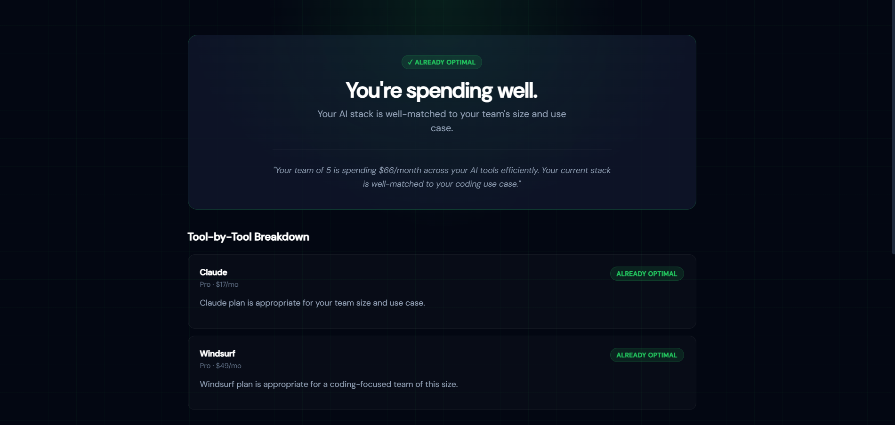

# SpendWise AI — Free AI Tool Spend Audit

SpendWise AI is a free web app for startup founders and engineering managers to audit their AI tool subscriptions — finding overspend, suggesting cheaper alternatives, and surfacing savings in under 60 seconds. No login required. Built as a lead-generation asset for [Credex](https://credex.rocks).

🔗 **Live:** https://spendwise-ai-nine.vercel.app

---

## Screenshots
### 📊 Dashboard

.png)

### ➕ Result


.png)
>
> Suggested shots:
> 1. The landing + form page
> 2. A results page showing savings breakdown
> 3. The lead capture / email gate modal

---

## Quick Start

```bash
# 1. Clone
git clone https://github.com/Nandithaofficial/spendwise-ai.git
cd spendwise-ai

# 2. Install
npm install

# 3. Set environment variables
cp .env.example .env.local
# Fill in: ANTHROPIC_API_KEY, RESEND_API_KEY

# 4. Run locally
npm run dev
# Open http://localhost:3000
```

### Deploy to Vercel

```bash
npx vercel --prod
# Set the same env vars in Vercel dashboard → Settings → Environment Variables
```

---

## Decisions

Five meaningful trade-offs made during the build:

1. **Hardcoded audit rules over AI inference for the audit engine.**
   The audit math (plan comparisons, seat-count logic, alternative recommendations) is deterministic rule-based logic, not LLM-generated. This makes results auditable, consistent, and fast. AI is used only for the personalized summary paragraph — the one place where natural language genuinely adds value.

2. **In-memory store over a hosted database.**
   Audit results and leads are stored server-side in memory (via `lib/store.ts`) rather than Supabase or Postgres. This eliminates infra setup time and keeps the project zero-dependency for deployment. The trade-off: data doesn't survive server restarts. For a production launch, this would be swapped for Supabase with a single schema change.

3. **No form state persistence across page reloads.**
   Form state lives in React `useState` only. Persisting to `localStorage` was considered but skipped to avoid over-engineering an MVP. Users rarely reload mid-form; the cost of losing state is low relative to the complexity of hydration-safe localStorage sync in Next.js.

4. **Honeypot field for abuse protection over hCaptcha.**
   A hidden `website` field silently accepts and discards bot submissions. This blocks the majority of automated form spam with zero UX friction and no third-party dependency. hCaptcha would be added before a high-traffic launch.

5. **React state for audit result routing instead of a separate `/results` page.**
   Results render on the same page by toggling state (`auditResult` null/set), keeping the URL clean for the unauthenticated flow. The shareable URL uses a separate `/audit/[id]` route so sharing still works. This avoids a full-page navigation for the primary happy path, making the experience feel instant.
   
---

## Repo Structure

```
spendwise-ai/
│
├── .github/
│   └── workflows/
│       └── ci.yml
│
├── app/
│   ├── api/
│   ├── audit/
│   ├── share/
│   ├── globals.css
│   ├── layout.tsx
│   └── page.tsx
│
├── components/
│   ├── forms/
│   ├── results/
│   ├── ui/
│   └── shared/
│
├── lib/
│   ├── audit-engine.ts
│   ├── pricing-data.ts
│   ├── recommendations.ts
│   ├── summary-generator.ts
│   ├── storage.ts
│   └── utils.ts
│
├── public/
│   ├── screenshots/
│   ├── og-image.png
│   └── favicon.ico
│
├── src/
│   └── __tests__/
│       └── audit-engine.test.ts
│
├── styles/
│
├── README.md
├── ARCHITECTURE.md
├── DEVLOG.md
├── REFLECTION.md
├── TESTS.md
├── PRICING_DATA.md
├── PROMPTS.md
├── GTM.md
├── ECONOMICS.md
├── LANDING_COPY.md
├── METRICS.md
├── package.json
├── package-lock.json
├── tsconfig.json
├── tailwind.config.ts
├── next.config.js
├── postcss.config.js
├── jest.config.js
├── .gitignore
└── .env.example
```